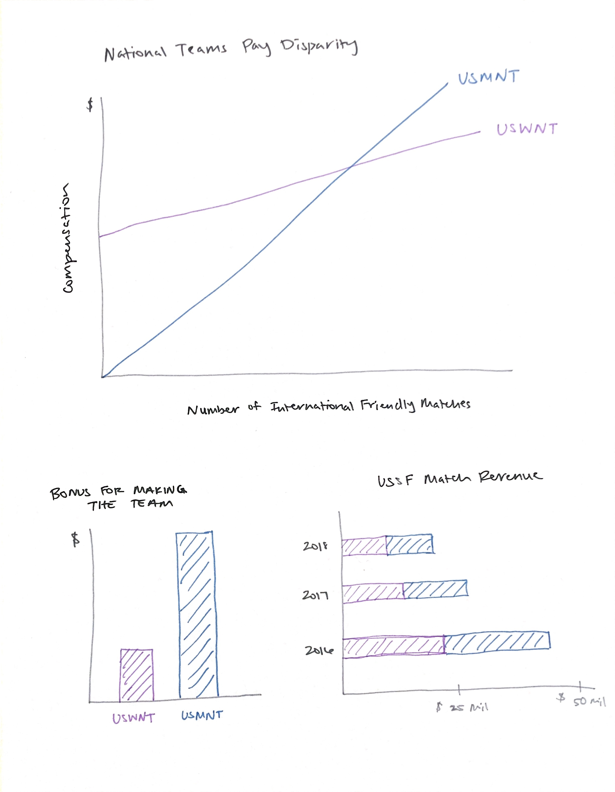

## Outline
For my final project, I will be diving into the pay disparity between the U.S. men's and women's national soccer teams. I will use available data to investigate and analyze the team's compensation formulas under their respective collective bargaining agreements, and then compare those findings with match records and revenue of the two teams. I'm particularly interested in showing how many matches each team would have to play/win/lose in a single season to receive equal pay under their current collective bargaining agreements.

* Setup: The USWNT is the No. 1 women's soccer team in the world with four World Cup Championships and four Olympic gold medals.
* Conflict: In March 2019, the USWNT filed a gender discrimination lawsuit against the U.S. Soccer Federation demanding equal pay.
* Resolution: Ask audience to form opinion on whether or not USSF should take action in regard to equal pay.

## Sketches

## Data
Unfortunately, the teams' collective bargaining agreements are not publicly accessible, so I had to collect data from a variety of sources, including news articles, financial statements and USSF's website. I have compiled two data sets from these sources. The first includes <a href="https://docs.google.com/spreadsheets/d/1WR4VmbQvyz70iNQn6G1ewB11vfklvjjUmJAIx8oljro/edit?usp=sharing" target="_blank">match records</a> for both teams from 2015-2018, and the second includes <a href="https://docs.google.com/spreadsheets/d/1fluI_ZfYY0zraSY97mcORW3JhNkSuLjHpT7hXy3SlGM/edit?usp=sharing" target="_blank">compensation and revenue data</a> compiled from news articles and financial statements. I've also compiled a <a href="https://docs.google.com/document/d/1ftre1Jz-AoPIcOrF2wkxFnN5bJl4_EClq8HZvA5iRuk/edit?usp=sharing" target="_blank">bibliography</a> with all of the sources from my research.

I plan to use this data to make comparisons between the two teams and illustrate exactly where any pay disparity occurs. One of the arguments for the lawsuit is based on the compensation earned by each team if each team were to win 20 international friendlies in a year. However, match records show that each team plays far fewer than 20 friendlies per year. I hope to investigate this argument and see if pay disparity still occurs at the teams' respective average friendly matches per year.

## Method & Medium
I plan to use Shorthand to develop my project storyline. I will use tools from class such as Datawrapper, RAW graphs and Tableau to design my data visualizations. I am curious to see if I can develop some kind of interactive feature that will allow the viewer to input a certain number of matches and return the teams' respective compensation at that level. Ultimately, I would like to walk the audience through the arguments of the current lawsuit, illustrating the different data points along the way, and ask them to make a decision for themselves on what the court's finding should be.

## Data Visualization Drafts
<iframe title="Bonus for Making World Cup Roster" aria-label="Column Chart" id="datawrapper-chart-zfOqZ" src="//datawrapper.dwcdn.net/zfOqZ/3/" scrolling="no" frameborder="0" style="width: 0; min-width: 100% !important; border: none;" height="349"></iframe>

<iframe title="Match Type by Team" aria-label="Stacked Column Chart" id="datawrapper-chart-VnOJy" src="//datawrapper.dwcdn.net/VnOJy/1/" scrolling="no" frameborder="0" style="width: 0; min-width: 100% !important; border: none;" height="354"></iframe>

<iframe title="National Team Match Revenue" aria-label="Stacked Bars" id="datawrapper-chart-yO32W" src="//datawrapper.dwcdn.net/yO32W/2/" scrolling="no" frameborder="0" style="width: 0; min-width: 100% !important; border: none;" height="195"></iframe>

<iframe title="U.S. Soccer Match Compensation" aria-label="Interactive line chart" id="datawrapper-chart-N0BKS" src="//datawrapper.dwcdn.net/N0BKS/1/" scrolling="no" frameborder="0" style="width: 0; min-width: 100% !important; border: none;" height="400"></iframe>

<iframe title="USWNT Win Bonus with Base Salary" aria-label="Interactive line chart" id="datawrapper-chart-hcMMX" src="//datawrapper.dwcdn.net/hcMMX/1/" scrolling="no" frameborder="0" style="width: 0; min-width: 100% !important; border: none;" height="400"></iframe>

<iframe title="National Team Expenses" aria-label="Interactive line chart" id="datawrapper-chart-sgy7P" src="//datawrapper.dwcdn.net/sgy7P/1/" scrolling="no" frameborder="0" style="width: 0; min-width: 100% !important; border: none;" height="400"></iframe>

<a href="https://infogram.com/5cad8ee6-245c-4236-9b1f-ca84b336a4e6" style="color:#989898!important;text-decoration:none!important;" target="_blank">World Cup Winnings</a> <a href="https://infogram.com" style="color:#989898!important;text-decoration:none!important;" target="_blank" rel="nofollow">Infogram</a>

<a href="https://infogram.com/f1431cde-ad6e-4977-be66-03ceeed6c814" style="color:#989898!important;text-decoration:none!important;" target="_blank">U.S. Soccer WC Bonuses</a> <a href="https://infogram.com" style="color:#989898!important;text-decoration:none!important;" target="_blank" rel="nofollow">Infogram</a>

