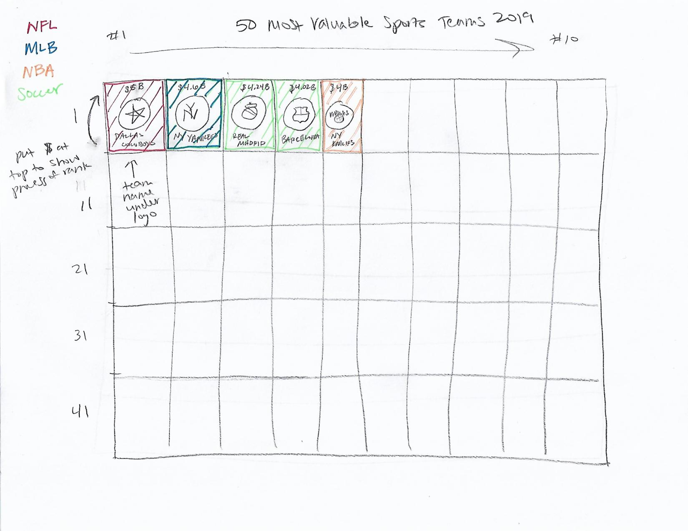

# Most Valuable Sports Teams in 2019
I chose to work with <a href="https://howmuch.net/articles/worlds-most-valuable-sport-teams" target="_blank">this graphic</a> based on Forbes' <a href="(https://www.forbes.com/sites/kurtbadenhausen/2019/07/22/the-worlds-50-most-valuable-sports-teams-2019/#26ebfab4283d" target="_blank">50 Most Valuable Sports Teams in 2019</a>.

While this is not necessarily a bad data visualization, there were a few things that I thought could be improved. First of all, I did not realize initially that the different shades of blue were representative of different value levels. I didn't see the key or even notice the color coding until I had been studying the chart for a while. Second, for being published on a financial website, the chart didn't highlight the value of the teams as much as one would think. Third, while I do like being able to see the breakdown by sports league (soccer, NFL, MLB, NBA), I would prefer to see the full data in order and then color code by sports league.

I began my process my sketching out a wireframe version of my revised chart. In this version, all 50 teams would be displayed in decreasing value, starting with Dallas Cowboys at No. 1 and moving left to right across the chart, row by row. I swapped the location of the team's value and the team name. With the team's logo displayed, and this being a finance graphic, it seemed more important to me to display the value at the top of the square, and then move the team name below the logo. Next, I color coded the squares by sports league. I also eliminated the owners' names from each team to reduce clutter.

I asked two people for feedback on my wireframe, and they had similar answers. Both people identified what the chart represented based on the title and were able to describe the reasoning behind the order of the teams displayed (team value). They both said the intended audience would be sports fans. One asked what the "value" was based on. Neither had any other recommendations. 

I tried to duplicate my sketch using tools from class, but since this is really more of an infographic, I had a hard time utilizing the resources we're supposed to work with. I could have designed something from scratch, but I chose to explore other options in Datawrapper and RAW Graphs to see what I could come up with. Eventually, I decided on a bar chart in Datawrapper. I was able to show all of the things I wanted to show from my wireframe - just in a different form than initially planned. 

First, I ordered the teams by value, labeling each bar with the dollar amount in billions. (As an aside - I couldn't get it to use the same number of decimals, but this is a design choice I would probably make - to show 5.00 rather than 5 so it is symmetric with 4.24, etc.) Next, I color coded the teams by sports league, with the key at the top. I also checked the colors for color blindness to make sure there was enough of a gradient difference in the colors I selected to still show the different leagues. I would have liked to incorporate the team logos somehow, but I think this version is clean and clear, and adding the logos back in might have just added clutter. Based on the feedback I received, I added a short description under the title stating where the "values" came from and noting that all values are in billions of dollars. 

<iframe title="50 Most Valuable Sports Teams in 2019" aria-label="Bar Chart" id="datawrapper-chart-WFzIM" src="//datawrapper.dwcdn.net/WFzIM/1/" scrolling="no" frameborder="0" style="width: 0; min-width: 100% !important; border: none;" height="1690"></iframe>
